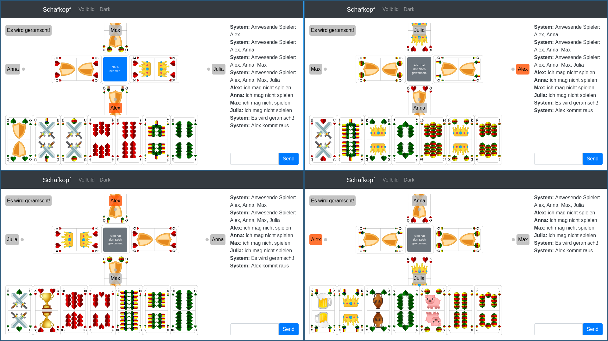
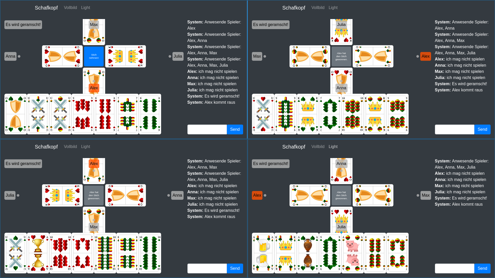

# Schafkopf
This is an Open Source implementation of the bavarian card game **Schafkopf**.

Feel free to check out the demo at: https://schafkopf.p4u1.de

Or run it on your own server with docker: `docker run -p 9080:80 -p 9443:443 thielepaul/schafkopf`

What can this app offer you:
* Play Schafkopf with friends in their browser
* No logins, no registration, no ads
* It's Open Source: feel free to adapt it to your needs
* No data is stored permanently on the server

## Screenshots

